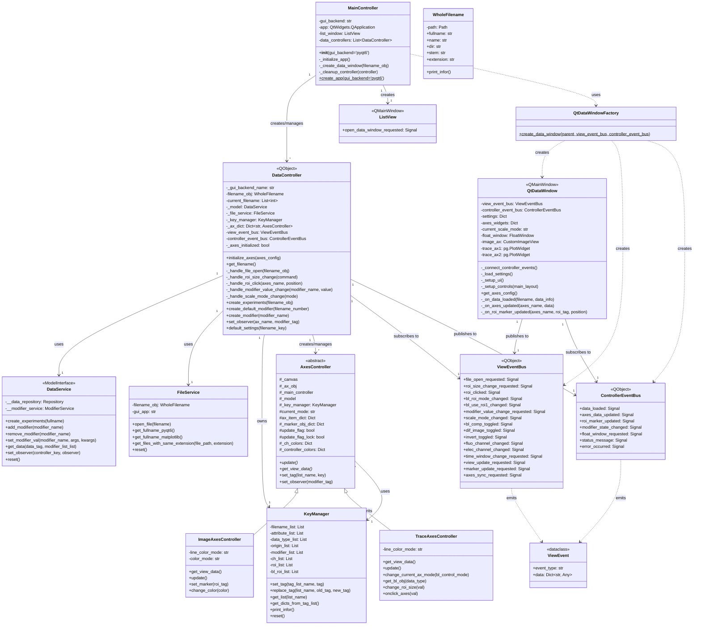

# Refactored ScanDataPy Class Diagram

## Overview
This document describes the class structure of the refactored ScanDataPy project, which now uses an event-driven architecture to eliminate circular dependencies.

## Class Diagram



## Key Architecture Features

### 1. Event-Driven Communication
- **ViewEventBus**: Handles all View → Controller communication
- **ControllerEventBus**: Handles all Controller → View communication
- No direct references between View and Controller layers

### 2. Dependency Flow
```
MainController
    ├── DataController
    │   ├── Model (DataService)
    │   ├── AxesControllers
    │   │   ├── ImageAxesController
    │   │   └── TraceAxesController
    │   ├── ViewEventBus (subscription)
    │   └── ControllerEventBus (publication)
    │
    └── QtDataWindow
        ├── UI Components
        ├── ViewEventBus (publication)
        └── ControllerEventBus (subscription)
```

### 3. Design Patterns Used
- **MVC Pattern**: Clear separation of Model, View, and Controller
- **Observer Pattern**: Event-based communication between layers
- **Factory Pattern**: QtDataWindowFactory for window creation
- **Composition**: Controllers manage sub-controllers and services

### 4. Benefits of Refactored Architecture
- **No Circular Dependencies**: Event buses prevent direct coupling
- **Testability**: Each component can be tested in isolation
- **Maintainability**: Clear separation of concerns
- **Extensibility**: Easy to add new views or controllers
- **Type Safety**: Uses type hints throughout